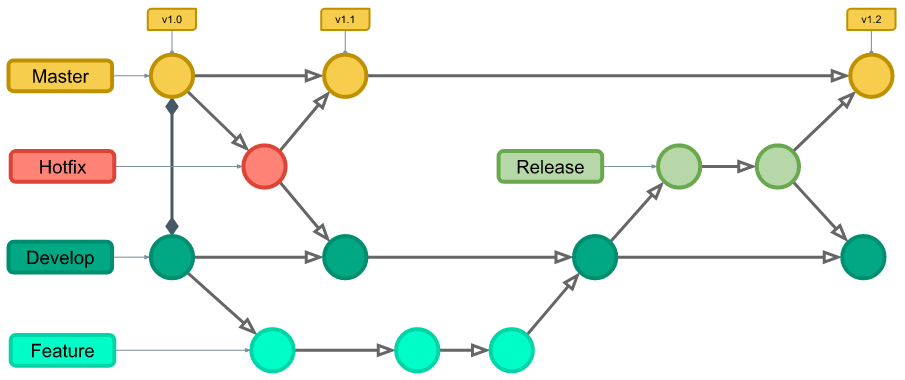

# Implementing-git-flow

## What is the gitflow branching strategy
Giflow is a Git branching model that involves the use of feature branches and multiple primary branches.

In this workflow, instead of a single main branch, this workflow uses two branches to record the history of the project. The main branch stores the official release history, and the develop branch serves as an integration branch for features. It's also convenient to tag all commits in the main branch with a version number.

## Overall flow of Gitflow.
When you create a new repository, it has a default branch which is the main branch.

### The overall flow of Gitflow is:

   - A develop branch is created from the main branch

   - A release branch is created from the develop

   - Feature branches are created from develop

   - When a feature is complete it is merged into the develop branch

   - When the release  branch is done it is merged into develop and main

   - If an issue in main is detected a hotfix branch is created from main

   - Once the hotfix is complete it is merged to both develop and main

## Implimenting the Gitflow method.
We have seen what the gitflow method is all about. Now lets impliment it.

### Fisrt thing lets  create a remote repository and link it to our local repository.
#### creating remote repository
- Log into your gitHub account and create a new repostory.
After creating the repository, lets go ahead and link our remote repository to our local repository. 

#### Linking remote repository to the local repository.
- Since we do not have a local repository yet, we will create a local repository  with just the README file and then link it to our remote repository. 
- Open gitbash create the local repository. On gitbash type the following commands.
        cd ~
        mkdir gitflow
        cd gitflow
        touch README.md

Now lets link our local repository to our remote repository and push the changes to the main branch.
note that the “remote github link“  is the link to the remote repository you created earliar.
        git init
        git add README.md
        git commit -m "first commit"
        git remote add origin "remote github link"
        git push -u origin main

So far we were just setting up our repositories and our project has just a single branch which is the main branch. Now lets go ahead and impliment the gitflow.

The first step is to complement the default main with a develop branch. A simple way to do this is for one developer to create an empty develop branch locally and push it to the server (here you are acting as the developer):
        git branch develop
        git push -u origin develop

We just created a develop branch and pushed our code to it. 

This branch will contain the complete history of the project, whereas main will contain a partial version. Other developers should now clone the repository and create a tracking branch for develop.

#### Feature branches
Each new feature should reside in its own branch.The feature branches use develop as their parent branch. When a feature is complete, it gets merge into the delelop branch. Features should never interact directly with main.
Creating a feature branch

- To create a future branch, change the parent branch to the develop.

Note that userstory/feature is the name of a feature the developer is to impliment that he is using as the branch name.
        git checkout develop
        git checkout -b userstory/feature

lets do some changes in our README file then commit and push the changes to our userstory/feature branch.

notepad README.md

Modify the README file by adding some text.

- Then commit and push the changes to the remote branch. 

#### Finishing a feature branch
When you’re done with the development work on the feature, the next step is to merge the feature branch into the develop branch.
        git checkout develop
        git merge userstory/feature

#### Release branches
Once develop has acquired enough features for a release (or a predetermined release date is approaching), you fork a release branch off of develop. Creating this branch starts the next release cycle, so no new features can be added after this point. only bug fixes, documentation generation, and other release-oriented tasks should go in this branch. Once it's ready to ship to production, the release branch gets merged into  main and tagged with a version number. In addition, it should be merged back into  develop, which may have progressed since the release was initiated.

Making release branches is another straightforward branching operation. Like feature branches, release branches are based on the  develop branch. A new release branch can be created using the following method. creating a release branch, ,make sure that your developed branch is upto date since multiple people are working on the project.

To create a release branch, do the following:
        git checkout develop
        git checkout -b release/0.1.0

Once the release is ready to ship, it will get merged it into main and  develop, then the release branch will be deleted. It’s important to merge back into develop because critical updates may have been added to the  release  branch and they need to be accessible to new features.

when you are done with the release branch, go ahead and merge with the main and delelop, then delete it.

In production, we can notice some bugs that were not seen during the release face so to fix this, we need to create a hot fix branch. A hot fix has main branch as parent.

#### Hotfix branches
Maintenance or hotfix branches are used to quickly patch production releases. hotfix branches are a lot like release branches and feature branches except they're based on main instead of develop. This is the only branch that should fork directly off of main. As soon as the fix is complete, it should be merged into both main and develop  and main should be tagged with an updated version number.

 A hotfix branch can be created using the following method.

note that hotfix_branch should be replace my the name of the bug we are fixing.
        git checkout main
        git checkout -b hotfix_branch

Similar to finishing a release branch, a hotfix branch gets merged into both main and develop.
        git checkout main
        git merge hotfix_branch
        git checkout develop
        git merge hotfix_branch
        git branch -D hotfix_branch
        $ git flow hotfix finish hotfix_branch

NB: Testing is usaully done on the  release branch reason for the bug fixes. 

This is one out of many branching strategies you can always impliment.

Read more: https://www.campingcoder.com/2018/04/how-to-use-git-flow/
